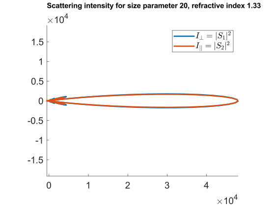

.. |zenodo| image:: https://zenodo.org/badge/DOI/10.5281/zenodo.17069741.svg
   :target: https://doi.org/10.5281/zenodo.17069741

|zenodo| 
 
# MIEV0 MATLAB interface (MEX API)
MATLAB interface to Dr. Warren Wiscombe's MIEV0 Fortran program.

Original MIEV0 program is widely known to be one of the most well-tested codes for calculating eletromagnetic scattering from a homogeneous sphere. Current repo aims at providing modern interface to this highly efficient and a de-facto reference Mie theory implementation, so that one could easily call it from MATLAB environment - either for research, or for education purposes.

## Features
All capabilities of the original MIEV0 program are retained. The following quantities are computed:
- scattering $Q_{sca}$ and extinction $Q_{ext}$ efficiencies;
- asymmetry factor $G_{qsc}$;
- forward- and backscatter amplitudes (SFORW and SBACK);
- scattering amplitudes vs. scattering angle for incident polarization perpendicular $S_1$ and parallel $S_2$ to the plane of scattering;
- coefficients in the Legendre polynomial expansions of either the unpolarized phase function or the polarized phase matrix (PMOM);
- and some other quantities related to polarized radiative transfer and resonance hitting.

More details on input parameters and output quantities are available in the original manual file authored by W. Wiscombe (```/wiscombe/MIEV.doc``` or converted version ```/wiscombe/MIEV.pdf```), as well as in comments within source code ```MIEV0.f```.
Very thorough description can be found in NCAR reports (```/wiscombe/NCARMieReport_Jun79.pdf``` and ```/wiscombe/NCARMieReport_Aug96.pdf```). One is also urged to refer to the original papers enumerated below.

I have made minor modifications to ```MIEV0.f``` and ```ErrPack.f``` source code files, mainly to enable support of double precision arithmetic and to ensure that MIEV0 error messages are properly displayed in MATLAB command window instead of crashing the whole thing. These changes are mainly reflected in changing data types from REAL and COMPLEX to REAL\*8 and COMPLEX\*16, correspondingly. Perhaps there was a more elegant way to do it, e.g. by using certain ifort compiler flags, but somehow attempting to do so in the MATLAB Command window has not been successful. As of now, even line numbering in MIEV0.f is completely the same as in the original file. Original files are kept for reference in the ```/wiscombe/``` folder. In addition, interface binaries based on the unmodified MIEV0.f are available in the ```/legacy/``` folder, built with the default single precision arithmetic. 

This interface has been intentionally implemented with a bit outdated non-interleaved MATLAB MEX API in order to ensure compatibility with older MATLAB releases.
Consequently, calls to the ```mlMIEV0.mexw64``` library are supported in all Windows MATLAB releases beginning with R2011a without imposing requirements for any additional software. 

Potentially, MEX library can also be compiled from the sources on other platforms (see general instructions below). Currently, I consider building binary files for Linux and Apple Silicon platrorms. Octave port might also be considered at a later time.


## Usage
At the moment, library is available as binary MEX file on **Windows** platform (x64 Intel and AMD) for **MATLAB R2011a** and subsequent releases. 

1. Download ```mlMIEV0.mexw64``` from the [Releases](https://github.com/ilopushenko/miev0_matlab_interface/releases) section and put it into your project folder.
2. Call mlMIEV0 as you would call any MATLAB function with appropriate input and output argument list:
```
[Qext, Qsca, Gqsc, S1, S2, Sforw, Sback, Tforw, Tback, Spike, PMOM] = ...
mlMIEV0(XX, Crefin, Perfct, Mimcut, Anyang, Numang, Xmu, Nmom, Ipolzn, Momdim, Prnt, Verbose);
```
Argument list fully corresponds to the original MIEV0 parameter list, so you are welcome to refer to the original documentation available e.g. in ```/wiscombe/MIEV.pdf```. One exception is the last "Verbose" argument which enables some additional output from the MATLAB-Fortran MEX interface.

An example file for computing and plotting scattering intensities $S_1$ and $S_2$ is available in the repo root folder (see ```example_scattered_intensities.m```). This script should result in the following polar plot (made with MATLAB R2022a):



## Validation
The implemented ```mlMIEV0.mexw64``` has mostly successfully undergone testing procedures outlined in the original ```/wiscombe/MVTstNew.f``` file. This subroutine features an exhaustive set of 19 test cases including extremely large size parameters, and covers most parts of the original MIEV0 program. To perform testing, pre-computed data contained within ```/wiscombe/MVTstNew.f``` was serialized into ```MVTstNew.mat``` file, and test script ```run_MVTstNew.m``` was written to compare the output from mlMIEV0.mexw64 with the reference quantities. One can confirm the good quality of the produced results by launching this script. Some small issues might remain: so far I have observed only one issue which is listed in the appropriate section below.

Additionally, the same test script was used to compare the results yielded by single precision version of the library (see ```/legacy/single_precision/run_MVTstNew.m```), which apparently fails to pass the extreme testing scenarios. 

Overall, the main version of library with double precision performs very well and is suitable for scientific applications.  

## Known issues
- Not all messages of the original code, including those governed by the PRNT input flag, are currently displayed in the MATLAB Command window.
- For two extreme test cases Tback and Tforw parameters differ from pre-computed values more than all other parameters in average. Yet, the difference is not that large and appears to be within the acceptable range.

You are very welcome to report any issues if you encounter any. 

## Build
Ideally, one should be able to build the library with any MATLAB edition, as soon as you also have [supported compiler(s)](https://www.mathworks.com/support/requirements/previous-releases.html) installed in your system. The command ```mex mlMIEV0.F90 MIEV0.f ErrPack.f``` launched from MATLAB Command window should then do the job.

In practice, current version faces some build-related difficulties in recent MATLAB editions as it is implemented with non-interleaved MATLAB MEX API. As a matter of fact, this causes some problems with copying arrays into Fortran-allocated memory after compiling with modern Visual Studio, Intel OneAPI / Parallel Studio XE and MATLAB R2018a+ editions. For this reason, currently MEX file has to be built with older frameworks. As already mentioned, advantage of this approach is compatibility of the produced MEX file with any subsequent MATLAB release (at least, Mathworks still maintain proper binary support). So, below the build procedure is discussed on the example of MATLAB R2011a, as this appeared to be the earliest version for which I already had compatible compilers. 

_I am considering the interface update for the interleaved MATLAB MEX API in order to perform proper build with up-to-date tools. However, current non-interleaved version will remain a priority one for compatibility purposes._

**Windows build instructions**:

Prerequisites (verified): Visual Studio 2008 Professional + Intel Fortran Compiler 11.1 + MATLAB R2011a. 

This list suggests that you have to be in posession of all of these classic compilers and frameworks. While MATLAB provides most of its editions legally through their website, it might be quite a challenge to find legal Intel and Microsoft compilers, as these were paid-only back in a day. In case you have these products, it's most likely that you already know what you are doing, so just ensure that you install VS2008 first, then IFC 11.1 with VS2008 integration, and execute 
```mex -setup```
 command in MATLAB to finish configuring your environment. After that, executing 
 
```mex mlMIEV0.F90 MIEV0.f ErrPack.f```

in MATLAB Command window results in a binary file ```mlMIEV0.mexw64``` (in case of the x64 platform).

Potentially, similar approach should work with any MATLAB up to R2017b and corresponding supported compilers (also on the x86 platform), as interleaved MEX API became a standard in R2018a, and Intel introduced its new Fortran compiler ifx (as a replacement to ifort) only in recent oneAPI releases. 

**Linux build directions**:

On linux, MATLAB supports GNU gfortran compiler. As original MIEV0 code is implemented within Fortran77 standard, it requires explicit compiler flag to be passed to gfortran in order for the build to succeed:
```
mex FFLAGS='$FFLAGS -ffixed-form' mlMIEV0.F90 MIEV0.f ErrPack.f
```
I have been able to get this command working and to produce a mlMIEV0.mexa64 binary file, however, at mlMIEV0 function call MATLAB exited without displaying any error or warning messages. So this requires more work to be done. Also, under Linux MATLAB library libgfortran.so is required to be present in the system for performing MEX file call. In the future this might prevent me from distributing the binary even if it compiles and works successfuly.

## Remarks
You are very welcome to use this library for education purposes, as well as for producing validation results for research papers.

As I do not possess any rights to the original MIEV0 code and just make use of the fact that it had been freely available for years from Dr. Wiscombe's anonymous NASA FTP at climate.gsfc.nasa.gov in the public folder (as well as a code listing in the '79 NCAR report referred below), in this repo MIT license only applies to the MEX interface and MATLAB files which were completely written by myself.

If you use this code, please make a reference to the original **W. Wiscombe Appl. Opt. 1980 paper**. Also I would be very happy if you recognize my efforts on implementing this MEX interface by mentioning it somewhere in the acknowledgements, or by referring to any applicable repository (this GitHub, [Zenodo](https://zenodo.org/records/17069742), or MATLAB File Exchange). 

## References
1. Wiscombe, W. ["Mie Scattering Calculations - Advances in Technique And Fast, Vector-Speed Computer Codes,"](https://www.researchgate.net/publication/253485579_Mie_Scattering_Calculations_Advances_in_Technique_and_Fast_Vector-speed_Computer_Codes) Ncar Tech Note TN-140+STR, National Center For Atmospheric Research, Boulder, Colorado (1979).
2. Wiscombe, W. ["Improved Mie scattering algorithms,"](https://doi.org/10.1364/AO.19.001505) Appl. Opt. 19, 1505-1509 (1980). 
3. Van De Hulst. "Light Scattering by Small Particles," Dover Press, New York (1957, 1982).
4. Bohren, C. and Huffman, D. "Absorption and Scattering of Light by Small Particles," Wiley, New York (1983).

